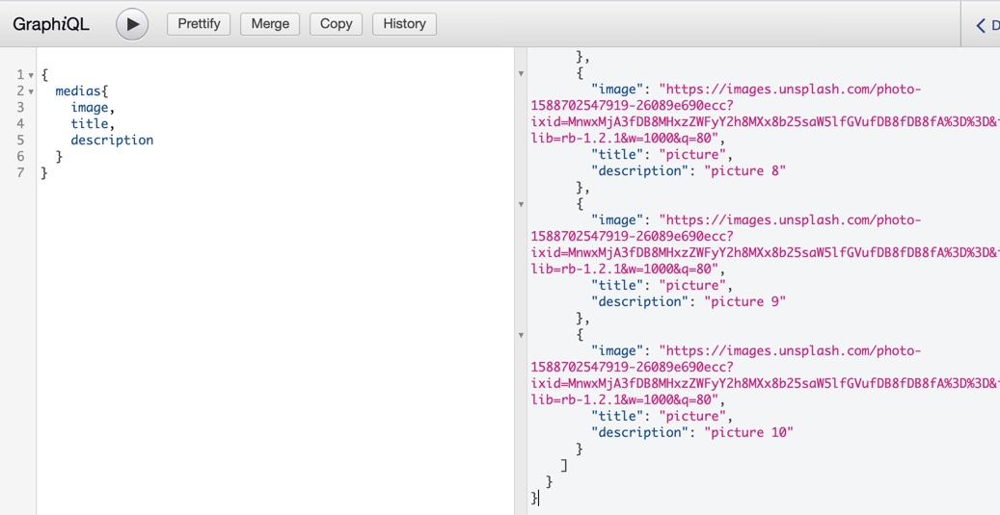

# backend
## Common setup

Clone the repo and install the dependencies.

```bash
git clone https://github.com/joyceiphone/backend.git
cd backend
```

```bash
npm install
```

## Steps for read-only access

To start the express server, run the following

```bash
npm run build
```

Open [http://localhost:4000/graphql](http://localhost:3000/graphql) and take a look around.


